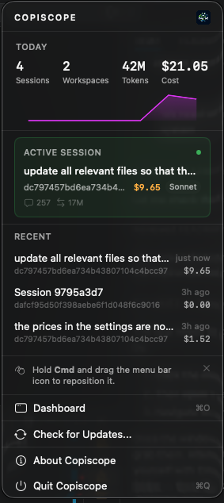
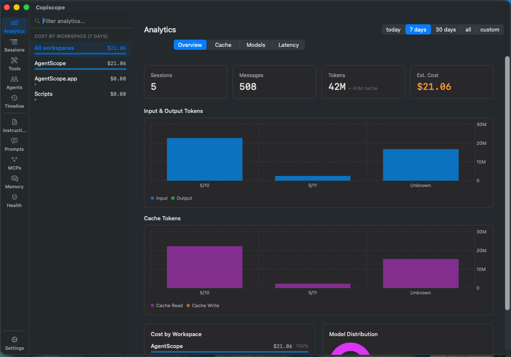
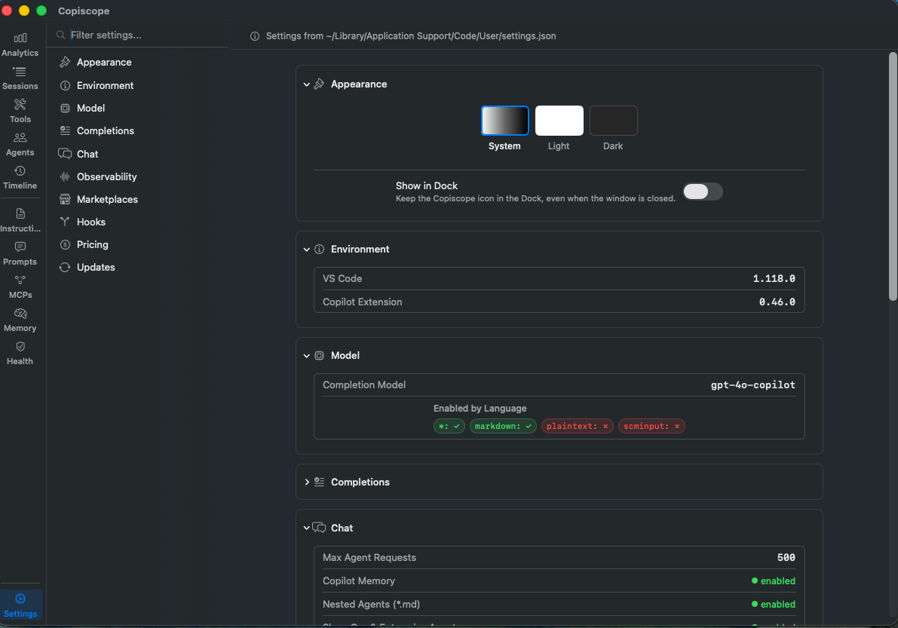

<p align="center">
  
</p>

<h1 align="center">Claudoscope</h1>

<p align="center">
  A native macOS menu bar app for exploring, analyzing, and managing your Claude Code sessions.
</p>

<p align="center">
  <a href="https://github.com/cordwainersmith/Claudoscope/releases/latest"></a>
  <a href="https://claudoscope.com/"></a>
  
  
  <a href="https://dl.claudoscope.com/stats"></a>
</p>

<p align="center">
  <a href="https://www.producthunt.com/products/claudoscope?embed=true&utm_source=badge-featured&utm_medium=badge&utm_campaign=badge-claudoscope" target="_blank" rel="noopener noreferrer"></a>
</p>

---

Claudoscope reads your local Claude Code session files (`~/.claude/projects/`) and surfaces them through a compact menu bar widget and a full-featured dashboard window. It provides real-time session tracking, cost estimation, analytics, plan browsing, timeline history, configuration health checks, and [**secret scanning that detects leaked credentials in your session history with real-time alerts**](#secret-scanning), all without sending any data off your machine.

## Table of Contents

- [Requirements](#requirements)
- [Installation](#installation)
- [How It Works](#how-it-works)
- [Secret Scanning](#secret-scanning)
- [Menu Bar Widget](#menu-bar-widget)
- [Dashboard Window](#dashboard-window)
  - [Analytics](#analytics)
  - [Sessions](#sessions)
  - [Tools](#tools)
  - [Plans](#plans)
  - [Timeline](#timeline)
  - [Hooks](#hooks)
  - [Commands](#commands)
  - [Skills](#skills)
  - [MCPs](#mcps)
  - [Memory](#memory)
  - [Config Health](#config-health)
  - [Settings](#settings)
- [Command Palette](#command-palette)
- [Cost Estimation](#cost-estimation)
- [License](#license)

## Requirements

- macOS 14.0 (Sonoma) or later
- Apple Silicon Mac (M1 or later). Intel Macs are not currently supported.
- Claude Code installed and used at least once (so that `~/.claude/projects/` exists with session data)

## Installation

### Homebrew (recommended)

```bash
brew tap cordwainersmith/claudoscope
brew install --cask claudoscope
```

### Updating

Claudoscope checks for updates automatically via GitHub Releases. When a new version is available, an indicator appears in the menu bar popover and in Settings > Updates. Clicking "Download and Install" downloads the new DMG, verifies its code signature, replaces the app, and relaunches. No manual steps required.

You can also update via Homebrew:

```bash
brew upgrade --cask claudoscope
```

Or disable automatic checks entirely in Settings > Updates.

### Manual install

Download the latest `Claudoscope.dmg` from the [Releases](https://github.com/cordwainersmith/Claudoscope/releases) page, open it, and drag Claudoscope to your Applications folder.

## How It Works

Claudoscope monitors `~/.claude/projects/` using macOS FSEvents for near-instant detection of changes to JSONL session files. Updates parse incrementally and surface in the UI in real time. No polling, no server process, no network requests, everything runs locally.

On launch, a one-time scan builds the initial project and session index. After that, only changed files are re-parsed, and parsed sessions are held in an LRU cache (capacity 20) for instant re-access.

The app runs as an accessory process (`LSUIElement = true`) and lives in your menu bar without a permanent Dock presence. The Dock icon appears only while the dashboard window is open.

## Secret Scanning

Claudoscope detects leaked credentials inside Claude Code session files and alerts you in real time. Ten credential patterns are scanned across your full Claude Code session history:

- Private keys (RSA, OpenSSH, PGP, EC)
- AWS access keys and secret access keys
- HTTP `Authorization` headers (Bearer, Basic)
- API keys and tokens
- Password literals in code, config, and connection strings
- Database connection strings with embedded credentials
- Platform tokens (GitHub PATs/OAuth, OpenAI, Anthropic, Stripe, Slack, npm, Google, SendGrid, Shopify, DigitalOcean, Linear, PyPI, HuggingFace, Azure, Vault, Docker)
- Slack incoming webhook URLs
- Critical platform tokens (Stripe live keys, Stripe webhook secrets, OpenAI service/admin keys, Anthropic admin keys, Azure storage account keys, Vault tokens) escalated to ERROR severity
- Subprocess credential exposure when env scrubbing is disabled

A multi-stage false-positive filter (Shannon entropy analysis, capture-group value extraction, randomness heuristics, and expanded allowlists for placeholders and conversational context) keeps noise low.

**Real-time alerts**: when a session file is updated, Claudoscope scans the tail of the file for new credentials and pops a floating alert panel on a match. Toggle in Settings > Security.

**Background full-history scan**: a complete sweep of all session files runs in the background under [Config Health](#config-health) and reports every match grouped by rule. Config and session checks load instantly while secret scanning progresses with an inline indicator.

All scanning is local. Detected secrets never leave your machine, and Claudoscope never transmits session content over the network.

## Menu Bar Widget

At-a-glance Claude Code activity without leaving what you are working on.



- **Stats strip**: today's session count, total tokens, estimated cost, and active project count
- **Sparkline chart**: compact daily usage trend
- **Active session card**: the live session (active in the last 60 seconds) with title, model, and token count
- **Recent sessions**: the three most recently active sessions across all projects
- **Dashboard shortcut**: opens the full dashboard window (Cmd+O)

## Dashboard Window

A three-column layout: a narrow icon rail on the left for navigation, a sidebar in the middle for lists and filtering, and a main content panel on the right.

### Analytics



Aggregates token usage and cost data across all your Claude Code sessions. A segmented picker switches between three tabs:

- **Overview**: summary cards (sessions, messages, tokens, cache tokens, estimated cost), daily usage bar chart, project cost breakdown, and model distribution by family
- **Cache**: hit ratio with cache-busting detection, stability callout, 5-minute vs. 1-hour TTL tier breakdown, per-session efficiency ranking, model-aware savings estimate, and cached vs. uncached cost comparison
- **Models**: daily cost by model chart, model efficiency table, and a what-if calculator that estimates savings from switching Opus usage to Sonnet

All tabs share a time range selector (7/30/90 days or custom) and an optional project filter.

### Sessions

The core session explorer. The sidebar lists all projects discovered under `~/.claude/projects/`, with sessions grouped by project. Each session row shows inline observability badges: error indicators (rate limits, auth failures, tool errors), idle/zombie gap warnings, and git worktree markers.

The chat view renders the complete conversation thread with:

- User messages, assistant responses, and tool use blocks
- Token usage per assistant turn (input, output, cache read, cache creation)
- Inline cost estimates per message
- Tool result content (file reads, bash output, search results)
- Error indicators on sessions or tool calls that encountered failures
- In-conversation search across messages, thinking blocks, tool inputs, and tool results, with auto-expansion of matching collapsed blocks

### Tools

Tool call data extracted from conversation history and presented per session, with a category breakdown (Read, Write, Exec, Other) and a detailed list of individual tool calls. Surfaces total calls, error rate, and unique files touched across sessions.

### Plans

All plan files created by Claude Code's `/plan` command, with title, creation date, and project. Selecting a plan renders the full markdown content.

### Timeline

Chronological history of Claude Code activity across all projects from the last 7 days. Each entry shows timestamp, project context, and session title.

### Hooks

All registered Claude Code hooks merged from five sources (user, project, project-local, plugin, managed) and grouped by event type, including `PreToolUse`, `PostToolUse`, `PermissionDenied`, `SessionStart`, `SessionEnd`, `Stop`, `UserPromptSubmit`, `Notification`, `PreCompact`, `PostToolUseFailure`, `FileChanged`, and any new event types as they appear. Each entry shows matcher pattern, command, timeout, and source label.

### Commands

All custom slash commands defined in your Claude Code configuration. Selecting a command renders its full markdown definition with the prompt template.

### Skills


All installed Claude Code skills, with name and trigger description. Selecting a skill renders its full definition and documentation.

### MCPs

All configured MCP (Model Context Protocol) servers from your Claude Code settings, with server name, command, arguments, and environment variables.

### Memory

All `CLAUDE.md` and memory files Claude Code uses for persistent context: the global `~/.claude/CLAUDE.md`, project-level `CLAUDE.md` files, and auto-memory files. Selecting a file renders its markdown content.

### Config Health

Runs 45 lint rules across your Claude Code configuration, sessions, and security posture, grouped into four categories: Security, Session Performance, Skills & Hooks, and Configuration.

- **Health score**: weighted summary (Excellent / Good / Fair / Poor) from error and warning counts
- **Severity filters**: click any stat card (Errors, Warnings, Info) to toggle on or off
- **Group by Rule** (default): collapses repeats, so "Missing description" shows once with a count and expandable list of affected skills, not 28 identical rows
- **Group by File**: flat list of all issues ordered by file
- **Rescan**: re-run all checks without switching tabs
- **Skill display names**: skills identified by directory name (e.g. "animate", "context7") instead of the repeated "SKILL.md" filename

Rule families: CLAUDE.md size and structure (**CMD**), rules YAML frontmatter and glob validation (**RUL**), skill metadata completeness and naming conventions (**SKL**), cross-cutting token budget estimates (**XCT**), and settings validation (**CFG**).

**Secret detection** (**SEC** rules) scans session JSONL files for accidentally leaked credentials across ten patterns, with a multi-stage false-positive filter and real-time alerts on new matches. See [Secret Scanning](#secret-scanning) for the full feature.

**Session health checks** (**SES** rules) analyze actual usage data from the last 30 days:

- **SES001**: session cost exceeded $25
- **SES002**: conversation triggered frequent context compaction
- **SES003**: cumulative token consumption exceeded expected spending
- **SES004**: session idle for 7+ days with 50+ messages
- **SES005**: session experienced API errors (rate limits, auth failures, proxy errors, tool errors)
- **SES006**: session resumed after 75+ minutes idle without `/clear` (zombie session)

Each session triggers at most one check (the most severe), capped at 10 results. Session results carry token and message count badges; "View Session" navigates directly to the session in the Sessions rail.

**Settings validation** (**CFG** rules) checks your `settings.json` for misconfigurations: sandbox enabled without lock files, contradictory filesystem permissions, bare mode conflicting with hooks/MCP, missing subprocess environment scrubbing, and skill shell execution without restriction.

### Settings



Reads your `~/.claude/settings.json` and presents each configuration section in an organized layout:

- **Appearance**: System, Light, or Dark theme, applied to the dashboard immediately
- **Model**: currently configured default model
- **Permissions**: permission rules and denied file patterns for read and edit operations
- **Security**: YOLO mode status, dangerous permission prompt handling, weaker sandbox settings, skill shell execution status, plus a toggle for real-time secret scanning alerts
- **Attribution**: attribution and credit configuration
- **Plugins**: installed plugins, source marketplaces, and any extra marketplace sources
- **Account**: startup count, last release notes version, onboarding status, key bindings
- **General**: transcript retention period, auto-memory toggle, and other preferences
- **Environment**: environment-level configuration values
- **Pricing**: Anthropic API or Vertex AI pricing with region selection (Global, us-east5, europe-west1, asia-southeast1). Changing the pricing configuration recalculates all cost estimates across the app.

## Command Palette

Press **Cmd+K** to open the command palette for quick navigation between rails and actions. Start typing to filter, then press Enter to jump.

## Cost Estimation

Claudoscope estimates session costs from raw token counts stored in JSONL session files. These are informational estimates based on published API pricing, not actual billing data.

For each assistant response, the JSONL parser accumulates four counters from the `usage` field: input tokens, output tokens, cache read tokens, and cache creation tokens. The model ID (e.g. `claude-opus-4-6-20250313`) maps to a pricing family, since Opus 4.5+ and Haiku 4.5+ price differently from earlier versions. Three pricing tables are built in (dollars per million tokens):

- **Anthropic API (direct)**: standard published rates including cache creation charges
- **Vertex AI (Global)**: same input/output rates as Anthropic, cache creation is free
- **Vertex AI (Regional)**: 10% surcharge over global rates on input, output, and cache read

Per-session cost is `(input + output + cache_read + cache_creation) / 1M`, each multiplied by its model rate.

**Caveat**: actual billed amounts depend on factors Claudoscope cannot observe, such as batch vs. real-time pricing tiers, committed-use discounts, or billing adjustments.

## License

MIT
