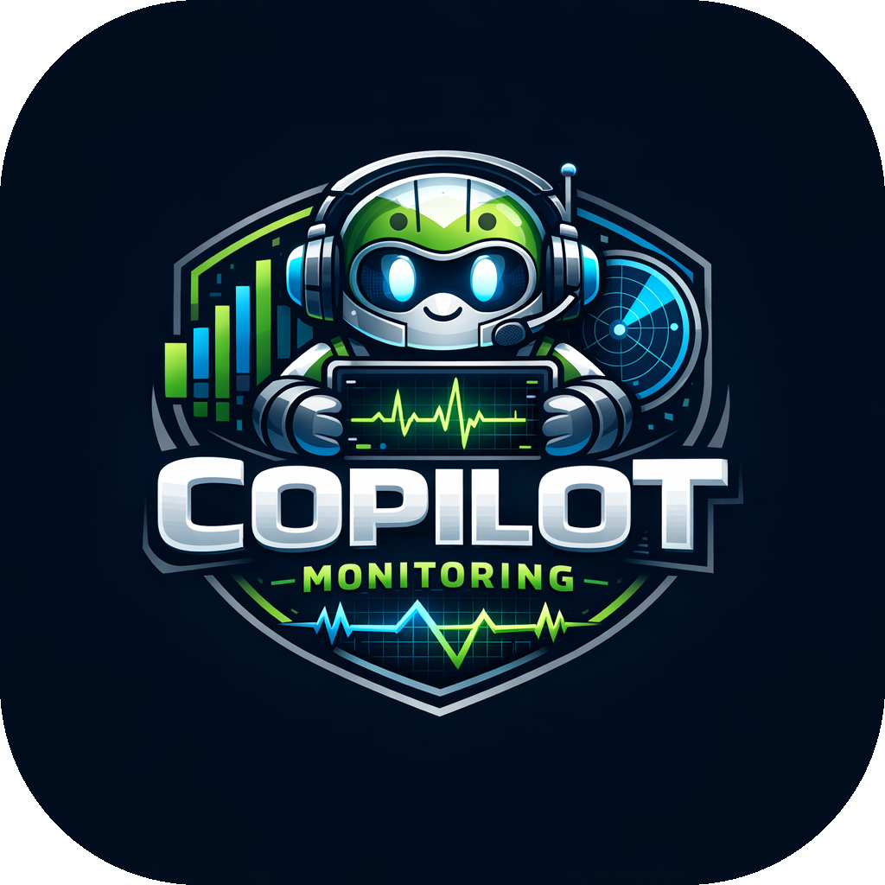
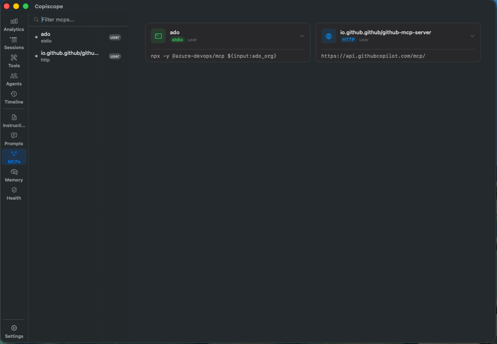
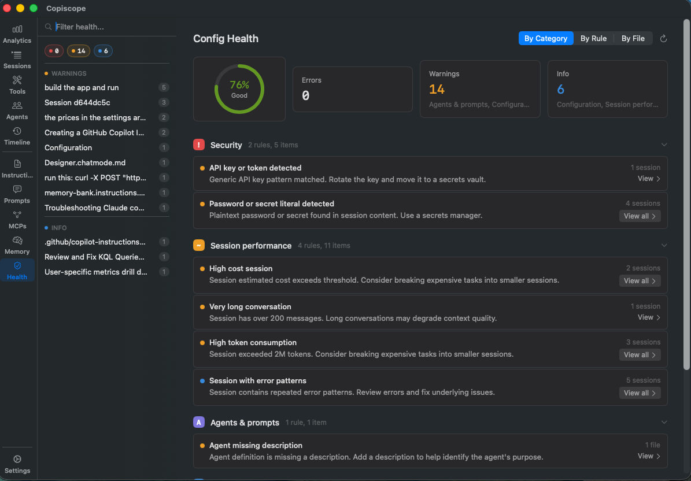

<p align="center">
  
</p>

<h1 align="center">Copiscope</h1>

<p align="center">
  A native macOS menu bar app for exploring, analyzing, and managing your GitHub Copilot agent sessions.
</p>

<p align="center">
  <a href="https://github.com/YoavLax/Copiscope/releases/latest"></a>
  
  
</p>

---

Copiscope reads your local GitHub Copilot session files from VS Code's `workspaceStorage` and surfaces them through a compact menu bar widget and a full-featured dashboard window. It provides real-time session tracking, cost estimation across all Copilot-supported models, analytics, timeline history, configuration health checks, and [**secret scanning that detects leaked credentials in your session history with real-time alerts**](#secret-scanning), all without sending any data off your machine.

## Table of Contents

- [Requirements](#requirements)
- [Installation](#installation)
- [How It Works](#how-it-works)
- [Secret Scanning](#secret-scanning)
- [Menu Bar Widget](#menu-bar-widget)
- [Dashboard Window](#dashboard-window)
  - [Analytics](#analytics)
  - [Sessions](#sessions)
  - [Tools](#tools)
  - [Agents](#agents)
  - [Timeline](#timeline)
  - [Instructions](#instructions)
  - [Prompts](#prompts)
  - [MCPs](#mcps)
  - [Memory](#memory)
  - [Config Health](#config-health)
  - [Settings](#settings)
- [Command Palette](#command-palette)
- [Cost Estimation](#cost-estimation)
- [License](#license)

## Requirements

- macOS 14.0 (Sonoma) or later
- Apple Silicon Mac (M1 or later). Intel Macs are not currently supported.
- VS Code with the GitHub Copilot Chat extension installed and used at least once (so that `workspaceStorage` contains session data)

## Installation

### Homebrew (recommended)

```bash
brew tap YoavLax/copiscope
brew install --cask copiscope
xattr -d com.apple.quarantine /Applications/Copiscope.app
```

### Updating

Copiscope checks for updates automatically via GitHub Releases. When a new version is available, an indicator appears in the menu bar popover and in Settings > Updates. Clicking "Download and Install" downloads the new DMG, verifies its code signature, replaces the app, and relaunches. No manual steps required.

You can also update via Homebrew:

```bash
brew upgrade --cask copiscope
```

Or disable automatic checks entirely in Settings > Updates.

### Manual install

Download the latest `Copiscope.dmg` from the [Releases](https://github.com/YoavLax/Copiscope/releases) page, open it, and drag Copiscope to your Applications folder.

### Gatekeeper / "App is damaged" prompt

Copiscope is not yet notarized with an Apple Developer ID. On first launch macOS may block it with a Gatekeeper warning. To allow it, run:

```bash
xattr -d com.apple.quarantine /Applications/Copiscope.app
```

Alternatively: right-click the app in Finder → **Open** → **Open** in the dialog. macOS remembers the exception and won't ask again.

## How It Works

Copiscope monitors `~/Library/Application Support/Code/User/workspaceStorage/` using macOS FSEvents for near-instant detection of changes to Copilot session files. It reads two session formats automatically:

- **Transcripts** (`GitHub.copilot-chat/transcripts/<id>.jsonl`) — the richer, preferred format used by recent Copilot versions
- **Chat sessions** (`chatSessions/<id>.jsonl`) — the newer VS Code storage format; parsed when transcripts are absent

Token and model data are supplemented from the Copilot `agent-traces.db` SQLite database (OpenTelemetry spans), which provides per-model token breakdowns for cost attribution.

On launch, a one-time scan builds the initial workspace and session index. After that, only changed files are re-parsed, and parsed sessions are held in an LRU cache (capacity 20) for instant re-access. No polling, no server process, no network requests — everything runs locally.

The app runs as an accessory process (`LSUIElement = true`) and lives in your menu bar without a permanent Dock presence. The Dock icon appears only while the dashboard window is open.

## Secret Scanning

Copiscope detects leaked credentials inside Copilot session files and alerts you in real time. Credential patterns scanned across your full session history include:

- Private keys (RSA, OpenSSH, EC)
- AWS access keys
- GitHub Personal Access Tokens and OAuth tokens
- HTTP `Authorization` headers (Bearer)
- API keys and tokens
- Password and secret literals in code, config, and connection strings
- Database connection strings with embedded credentials
- npm and Slack tokens

A false-positive filter (capture-group value extraction and allowlists for placeholders and conversational context) keeps noise low.

**Real-time alerts**: when a session file is updated, Copiscope scans the new content for credentials and pops a floating alert panel on a match. Toggle in Settings > Security.

**Background full-history scan**: a complete sweep of all session files runs under [Config Health](#config-health) and reports every match grouped by rule. Session and configuration checks load instantly while secret scanning progresses with an inline indicator.

All scanning is local. Detected secrets never leave your machine, and Copiscope never transmits session content over the network.

## Menu Bar Widget

At-a-glance GitHub Copilot activity without leaving what you are working on.


- **Stats strip**: today's session count, total tokens, estimated cost, and active workspace count
- **Sparkline chart**: compact daily usage trend
- **Active session card**: the live session (active in the last 60 seconds) with title, model, and token count
- **Recent sessions**: the three most recently active sessions across all workspaces
- **Dashboard shortcut**: opens the full dashboard window (Cmd+O)

## Dashboard Window

A three-column layout: a narrow icon rail on the left for navigation, a sidebar in the middle for lists and filtering, and a main content panel on the right.

### Analytics


Aggregates token usage and cost data across all your Copilot sessions. A segmented picker switches between tabs:

- **Overview**: summary cards (sessions, messages, tokens, estimated cost), daily usage bar chart, workspace cost breakdown, and model distribution by vendor (Anthropic, OpenAI, Google, xAI)
- **Models**: daily cost by model chart and model efficiency table across all Copilot-supported models
- **Latency**: per-turn response time breakdown sourced from OpenTelemetry span data

All tabs share a time range selector (7/30/90 days or custom) and an optional workspace filter.

### Sessions

The core session explorer. The sidebar lists all VS Code workspaces discovered in `workspaceStorage`, with sessions grouped by workspace. Each session row shows inline observability badges: error indicators and session metadata.

The chat view renders the complete conversation thread with:

- User messages, assistant responses, and tool use blocks
- Token usage per assistant turn (input, output, cached)
- Inline cost estimates per message
- Tool result content
- Error indicators on sessions or tool calls that encountered failures
- In-conversation search across messages, tool inputs, and tool results, with auto-expansion of matching collapsed blocks

### Tools

Tool call data extracted from conversation history and presented per session, with a category breakdown (Read, Write, Exec, Other) and a detailed list of individual tool calls. Surfaces total calls, error rate, and unique files touched across sessions.

### Agents

Agent tree view showing the hierarchical structure of agent turns and sub-agent calls within a session, sourced from OpenTelemetry span data.

### Timeline

Chronological history of Copilot activity across all workspaces from the last 7 days. Each entry shows timestamp, workspace context, and session title.

### Instructions

All `.instructions.md` and `copilot-instructions.md` files in your workspace, including repository-scoped (`.github/copilot-instructions.md`) and workspace-scoped instruction files. Selecting a file renders its full content.

### Prompts

All `.prompt.md` reusable prompt files discovered in your workspace. Selecting a prompt renders its full definition.

### MCPs



All configured MCP (Model Context Protocol) servers from your Copilot settings, with server name, command, arguments, and environment variables.

### Memory

Copilot memory and context files, including auto-memory and scoped context files. Selecting a file renders its markdown content.

### Config Health



Runs lint checks across your Copilot configuration, sessions, and security posture.

- **Health score**: weighted summary (Excellent / Good / Fair / Poor) from error and warning counts
- **Severity filters**: click any stat card (Errors, Warnings, Info) to toggle on or off
- **Group by Rule** (default): collapses repeats so the same issue across multiple files shows once with a count and expandable list
- **Group by File**: flat list of all issues ordered by file
- **Rescan**: re-run all checks without switching tabs

Rule families:

- **INS** — instruction file quality (file too long, malformed YAML frontmatter)
- **XCT** — token budget estimates across all instruction and agent files
- **SES** — session performance (high cost, very long conversations, high token consumption, sessions with errors)
- **SEC** — secret detection across session JSONL files

**Secret detection** (**SEC** rules) scans session JSONL files for accidentally leaked credentials, with a false-positive filter and real-time alerts on new matches. See [Secret Scanning](#secret-scanning) for the full feature.

**Session health checks** (**SES** rules) analyze actual usage data:

- **SES001**: session estimated cost exceeded $2
- **SES002**: conversation is very long (>50 messages)
- **SES003**: cumulative token consumption exceeded 300k tokens
- **SES004**: session contains a request that ended in an error

Each session check is capped at 10 results. Session results carry token and message count badges; "View Session" navigates directly to the session in the Sessions rail.

### Settings


- **Appearance**: System, Light, or Dark theme, applied to the dashboard immediately
- **Billing plan**: select your GitHub Copilot plan (Free, Pro, Pro+, Business, Enterprise) to contextualize cost estimates
- **Updates**: automatic update checks via GitHub Releases, with manual check and download controls
- **Security**: toggle for real-time secret scanning alerts

## Command Palette

Press **Cmd+K** to open the command palette for quick navigation between rails and actions. Start typing to filter, then press Enter to jump.

## Cost Estimation

Copiscope estimates session costs from token counts stored in session files, supplemented by OpenTelemetry span data from `agent-traces.db`. These are informational estimates based on published GitHub Copilot pricing, not actual billing data.

Token counts are broken down by model per session. Each model maps to a pricing entry (dollars per million tokens). Pricing is sourced from [GitHub Copilot billing documentation](https://docs.github.com/en/copilot/reference/copilot-billing/models-and-pricing) (1 AI credit = $0.01 USD). Models supported include:

- **Anthropic**: Claude Opus, Sonnet, Haiku (various versions)
- **OpenAI**: GPT-4o, GPT-4.1, GPT-5 family
- **Google**: Gemini 2.5 Pro, 3.0 Flash, 3.1 Pro
- **xAI**: Grok Code Fast

Per-session cost is `(uncached_input + output + cached_input + cache_creation) / 1M`, each multiplied by the model's rate.

**Caveat**: actual billed amounts depend on factors Copiscope cannot observe, such as your Copilot subscription tier, included seat allowances, or billing adjustments.

## License

MIT

---

## Acknowledgements

Special thanks to Liran Baba for the inspiration.

| <br><sub>@cordwainersmith</sub><br><br>[](https://github.com/cordwainersmith)<br>[](https://www.linkedin.com/in/liranba/) |
|---|
